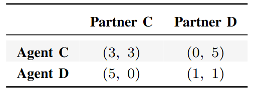

# Multi-Agent Iterated Prisoner’s Dilemma

## Can Q-Learning agents learn optimal policies against different types of agents?

This project, developed for the Distributed Artificial Intelligence exam, investigates whether learning agents can infer optimal strategies when interacting in a multi-agent environment based on the Iterated Prisoner’s Dilemma.

## Procedure

The methodology is divided into four main phases:

1. **Design Phase 1**  
   Definition of the initial agent types and implementation of a flat simulation environment.

2. **Experiments in Flat Environment**  
   Evaluation of the agents’ behaviour and learning performance in the initial simplified setting.

3. **Design Phase 2**  
   Extension of the framework with additional agent types and the introduction of a spatial environment to enable more realistic interactions.

4. **Experiments in Spatial Environment**  
   Final experiments conducted in the spatial setting to analyse how environmental structure affects learning and strategy formation.

## Design Phase 1

### Agents

- **Cooperator**: always cooperates, regardless of the opponent’s actions.  
- **Defector**: always defects in every interaction.  
- **Tit-for-Tat**: starts by cooperating and then mirrors the opponent’s previous action.  
- **Learner (Q-learning agent)**: selects actions based on a Q-table conditioned on the identity of the current partner, allowing it to learn optimal strategies over time.

---

### Learner: State, Q-tables, and Reward Function

#### State representation
The state is defined as a tuple:

`(own_last_action, partner_last_action)`

where each action can be either **cooperate (0)** or **defect (1)**.

#### Action space
- 0 = cooperate  
- 1 = defect  

#### Reward function
The reward is determined by the standard Prisoner’s Dilemma payoff matrix, based on the joint actions of both agents.

#### Q-tables
Each learner maintains a separate Q-table for each opponent:

`Q = {partner_id : Q-table}`

This design allows the agent to adapt its strategy depending on the specific opponent it interacts with.

#### Update
`Q(s, a) ← Q(s, a) + α [ r + γ * max(Q(s', a')) − Q(s, a) ]`
