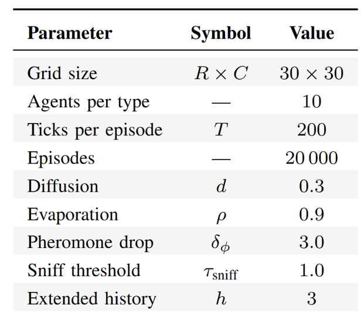

# Multi-Agent Iterated Prisoner’s Dilemma

## Can Q-Learning agents learn optimal policies against different types of agents?

This project, developed for the Distributed Artificial Intelligence course, investigates whether learning agents can infer optimal strategies when interacting in a multi-agent environment based on the Iterated Prisoner’s Dilemma.

---

## Procedure

The methodology is divided into four main phases:

1. **Design Phase 1**  
   Definition of the initial agent types and implementation of a flat simulation environment.

2. **Experiments in the Flat Environment**  
   Evaluation of the agents’ behaviour and learning performance in the initial simplified setting.

3. **Design Phase 2**  
   Extension of the framework with additional agent types and the introduction of a spatial environment to enable more realistic interactions.

4. **Experiments in the Spatial Environment**  
   Final experiments conducted in the spatial setting to analyse how environmental structure affects learning and strategy formation.

---

## Design Phase 1

### Agents

- **Cooperator**: always cooperates, regardless of the opponent’s actions.  
- **Defector**: always defects in every interaction.  
- **Tit-for-Tat**: starts by cooperating and then mirrors the opponent’s previous action.  
- **Learner (Q-learning agent)**: selects actions based on a Q-table conditioned on the identity of the current partner, allowing it to learn optimal strategies over time.

---

### Learner: State, Q-Tables, and Reward Function

#### State Representation

The state is defined as a tuple:

`(own_last_action, partner_last_action)`

where each action can be either **cooperate (0)** or **defect (1)**.

---

#### Action Space

- `0` = cooperate  
- `1` = defect  

---

#### Reward Function

The reward is determined by the standard Prisoner’s Dilemma payoff matrix, based on the joint actions of both agents.

---

#### Q-Tables

Each learner maintains a separate Q-table for each opponent:

`Q = {partner_id : Q-table}`

This design allows the agent to adapt its strategy depending on the specific opponent it interacts with.

---

#### Q-Learning Update Rule

`Q(s, a) ← Q(s, a) + α [ r + γ * max(Q(s', a')) − Q(s, a) ]`

---

### Flat Environment

At each tick, agents interact according to the following rules:

- **Pairing**: at each tick, agents are randomly paired across the population, and each pair plays one round of the Prisoner’s Dilemma.  
- **Episode**: an episode consists of 200 ticks.  
- **Reset**: scores are reset at the end of each episode, while Q-tables and partner interaction histories are preserved.

---

## Flat Environment Experiments

Results are available in the directory [results/](results/).

### 1 vs 1

To evaluate the Learner’s adaptability in isolation, a single Learner is paired exclusively with one fixed-type agent for 10,000 episodes. This controlled setup removes population-level confounds and highlights the pure learning dynamics against each opponent type.

Against Cooperators, Defectors, and Tit-for-Tat agents, the Learner converges to the optimal policies. Against another Learner, however, instability emerges due to the non-stationary nature of simultaneous Q-learning updates.

---

### Heterogeneous Population

To evaluate the Learner in a more realistic setting, the experiment is extended to a population of 40 agents:

- 10 Cooperators  
- 10 Defectors  
- 10 Tit-for-Tat agents  
- 10 Learners  

At each tick, agents are randomly paired across the entire population, allowing each Learner to interact with all opponent types throughout training. The experiment runs for 20,000 episodes.

The experiment confirms that a Q-learning agent with a minimal state representation is capable of inferring and adopting opponent-specific strategies without any prior knowledge of the partner’s type.

---

## Design Phase 2

### New Agents

To introduce more complex strategies, additional agent types are added alongside the original ones:

- **Unforgiving**: cooperates until the partner defects once; after that single defection, it permanently switches to defection against that partner.  
- **Pheromones**: combines local signalling with conditional cooperation.  
- **LearnerExt**: extends the Learner state representation by memorising the last `h` actions of each partner.

---

### Spatial Environment

The previous flat simulation pairs agents uniformly at random, implicitly assuming a well-mixed population. However, real interaction networks are rarely well mixed.

To study agent behaviour in a more realistic setting, a NetLogo-like toroidal grid environment (30×30 by default) is introduced. Each cell can contain at most one agent. The grid also maintains a scalar pheromone field.

All agents, except Pheromone agents, move to a random neighbouring cell. Pheromone agents instead move toward the empty neighbouring cell with the highest pheromone concentration. If the pheromone level is not sufficiently high, they move randomly like the other agents.

After movement, each agent selects one random neighbour to interact with; agents with no occupied neighbours skip the tick. Pairs are resolved without repetition within the same tick.

---

## Spatial Environment Experiments

The experiment is repeated 10 times, each with a different random seed. The seeds used are in the range `[0-9]`. A warm-up period of 8,000 episodes is also adopted.

The parameters used are reported in the following table:

The results show that Learners are able to adapt to different opponent strategies. They also highlight that the best-performing strategies are:

- Tit-for-Tat  
- Pheromones  
- Learner  
- LearnerExt  

A Mann–Whitney statistical test indicates that Learner performs significantly better than LearnerExt, while no statistically significant difference can be established among Tit-for-Tat, Pheromones, and Learner.
